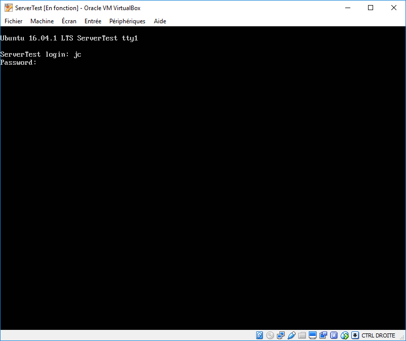
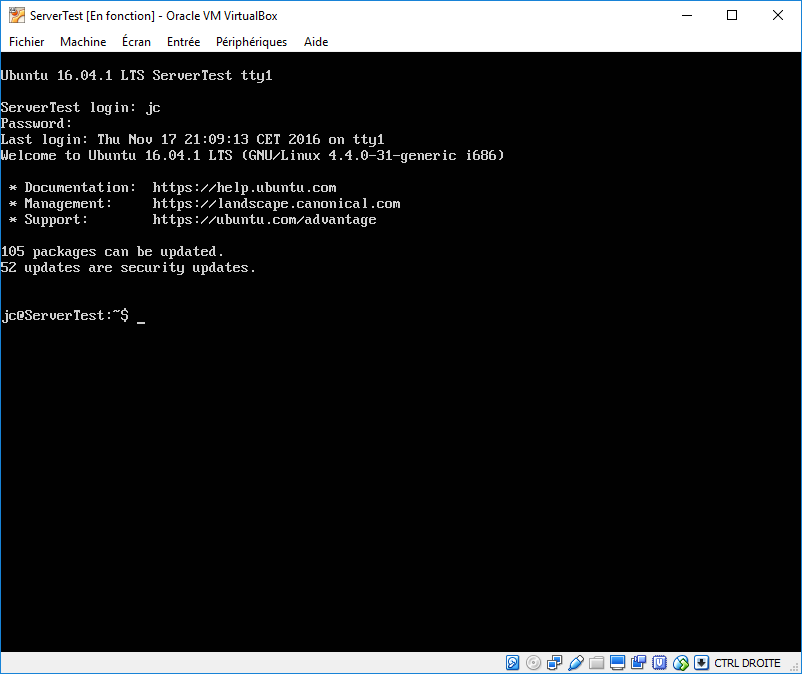
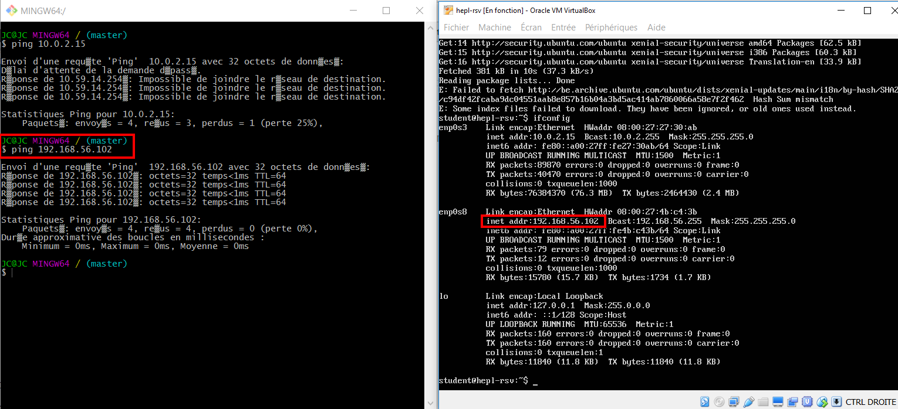
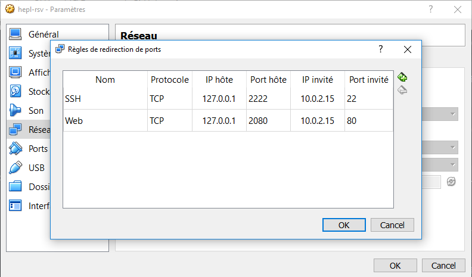
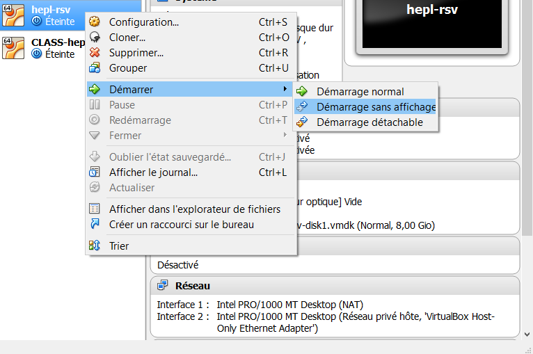
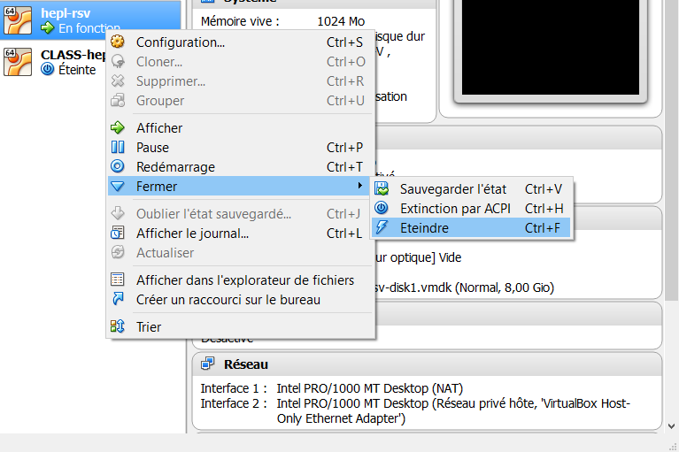
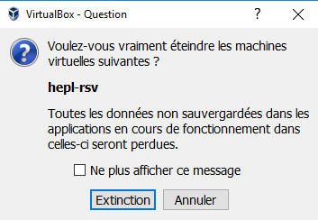

# Configurer le serveur pour le web

---

This is a tutorial for configurate a web server for students of [@hepl](https://github.com/hepl-web).

Work forked on : https://github.com/hepl-rsv/Web-Server-Config

---


[Maintenant que vous avez installé une machine virtuel](https://github.com/hepl-rsv/VirtualBox-install) _(avant de commencer ce tutoriel, veuillez d'abords suivre le tuto précédent)_, voici comment la configurer pour qu'elle devenienne un serveur en installant dans un premier temps les services d'`apache` et en configurerant correctement ses fichiers.

Voici toutes les commandes à taper (dans l'ordre) afin d'arriver au résultat recherché.

Tout d'abords entrer l'utilisateur (user)


Ainsi que le mot de passe (mp)



Vous devriez obtenir ceci (désormais, je ne mets plus de captures d'écran, juste les commandes à taper sur la machine) :



> __Mettre à jour la liste de tous les packages__ (~programmes) devant être présent sur la machine (Vous devrez probablement entrer à nouveau le mp)

```
sudo apt-get update
```

> Faire de même pour lancer __l'installation des mises à jour des packages__ (il vous demandera de confirmer l'installation, entrer `y` + `ENTER`)

```
sudo apt-get upgrade
```

> Si le clavier n'est pas bien configuré __ÉTAPE NON NÉCESSAIRE__ _vous pouvez sauter directement à l'étape suivante_

```
sudo dpkg-reconfigure keyboard-configuration
```

> Pour installer apache2 (il vous demandera de confirmer l'installation, entrer `y` + `ENTER`)

```
sudo apt-get install apache2
```

Nous venons de mettre à jour notre machine et avons installé apache. Maintenant nous allons vérifier que la machine réponde correctement avec le terminal (git pour windows).

__Sur la machine :__
> Prendre l'adresse ip (permet de connaitre aussi les parmètres de la carte réseau)

```
ifconfig
```

Maintenant __dans le terminal__ (ou dans git), nous allons faire un ping sur l'adresse du serveur, dans notre cas `ping 192.168.56.102`



Si vous obtenez une perte de 0%, nous pouvons continuer et __faire la redirection de ports.__
Dans virtualBox faites un clic droit sur votre machine et sélectionez `Configuration...` -> `Réseau` -> `Avancé` -> `redirection de ports`

> Soit on fait du ``mappage`` de port : on dit que tels tels tels ports sont redirigé sur la vm:
> - il y a le web port 80
> - et il y a le port ssh 22
> - l'ip de la machine est par défaut 10.0.2.15
> - l'ip 127.0.0.1 c'est l'ip en local


Cliquer sur `Ajouter une nouvelle règle de redirection` (icone verte à droite) et entrer les donnes suivantes et faire `OK` quand vous avez finit __PAS de redémarage requis pour la VM__




> __ATTENTION__ remplacer `student` par votre user

__Dans le terminal__ (ou dans git) taper :  

```
$ ssh -l student -p 2222 127.0.0.1
```

> Aller dans le dossier web d'appache `/var/www`. Nous allons modifier la page par défaut d'apache

```
cd /var/www/html
```

> Lister le contnu du dossier

```
ls -FAlh
```

> Regardons ce que contient le fichié index.html

```
cat index.html
```

Vous pouvez voir ce que ça donne en ouvrant votre navigateur et en entrant http://127.0.0.1:2080/

> Maintenant supprimer cette page par défaut (il vous demande de confirmer, entrer `y` + `ENTER`)

```
rm index.html
```

> Vous allez avoir une erreur de type `Permission denied`, c'est normal vu qu'il faut être en admin pour pouvoir le supprimer. Alors petite astuce pour mettre le sudo à la commande précédemment tappée (il va vous demander le mot de passe et il n'y aura plus d'erreurs)

```
sudo !!
```

> Créer un nouveau fichier index.html et n'oublions pas cette fois-ci de préfixer notre commande de sudo. __Si jamais vous faites par erreur dans nano un `CTRL`+`Z`__ (qui ne produit pas un retour en arrière) écrivez `gf` pour faire réaparaitre votre fichier(car il disparait si vous faites un `ls` vu qu'il se met en tâche d'arrière plan et ne peut être annulé que par la commande `gf`). _Cette remarque est valable à chaque fois que nous utiliserons nano dans ce tuto_

```
sudo nano index.html
```

Introduire dans le nouveau fichier `Hello world !` par exemple et faire `CTRL` + `O` pour sauvegarder et puis `ENTER` pour confirmer ensuite `CTRL` + `X` pour quitter

> Afficher le contenu de votre index pour vérifier vos modifications

```
cat index.html
```

> Maintenant, accédez à votre dossier utilisateur. Ce sera là où vous stockerez les dossiers contenant les sites du serveur.

```
cd 
```

> Créer le dossier de votre premier site.

```
sudo mkdir first-website
```

> Entrer dans son dossier

```
cd first-website
```

> Créer la page d'accueil du site (même oppération que tout à l'heure MAIS ne pas mettre le même contenu, ici par exemple mettre `Hey !` + refaire un cat pour vérifier le contenu)

```
sudo nano index.html
```

> Accéder au `sites-available` c'est dans ce dossier que l'on met en relation les dossiers avec le contenu navigable du serveur.

```
cd /etc/apache2/sites-available
```

> Regarder le contenu de ce dossier

```
ls -FAlh
```

> Éditer le fichier `000-default.conf`

```
sudo nano 000-default.conf
```
----------------------------------------------------------------------------------------------------------------------------------------------------------------------------------------------------
=> _En fait ce que nous allons faire ici ne suffira pas, lisez quand même à titre d'information ce que nous avons fais, mais cela ne sert à rien de reproduire la même erreur. Recommencer à suivre les directives à partir du cours du 9/12_

À la ligne `DocumentRoot /var/www/html` remplacer par `DocumentRoot /etc/apache2/sites-enabled/first-website` (ensuite faire la même chose pour enregistrer et quitter, expliqué ci-dessus) 

> Redémarer le service apache pour qu'il tienne compte des modifications

```
sudo service apache2 reload
```

> Pour complètement relancer tout le service on peut aussi faire ceci

```
sudo service apache2 restart
```

> pour arrêter le système (+ mp user)

```
sudo shutdown now
```

__Pour le prochain démarrage de la machine,__ faites clic droit -> `Démarrer` -> `Démarrage sans affichage` car par la suite on utilisera uniquement la machine en ligne de commande par ssh avec le terminal (ou git).   
Ensuite pour l'éteindre il vous suffira de faire un clic drtoi et d'aller dans -> `Fermer` -> `Éteindre`

__Démarrage sans affichage :__   


__Éteindre :__   


__Confirmation :__   


---------------------------------------------
__Cours du 9/12 :__  

> Se reconnecter en ssh avec le terminal :

```
$ ssh -l student -p 2222 127.0.0.1
```

Nous avions un problème de permission en lecture. Que nous allons régler ici. Nous avions un `404 forbiden`, car par défaut apache ne donne pas accès aux dossiers des utilisateurs.  


On aimerait configurer tout le site dans un seul endroit.
Accès à 000 avec nano


> Voici à quoi doit ressembler notre fichier `/etc/apache2/sites-available/000-default.conf` (je ne remets plus la procédure à faire pour accéder à ce dossier via un cd)

Dans nano pour supprimer des lignes, faites `CTRL` + `K` ainsi vous pourrez supprimer toutes les lignes non nécessaires commençant par `#` (commentaire)

```
<VirtualHost *:80>
        DocumentRoot /home/student/first-website

        <Directory /home/student/first-website>

                Require all granted

        </Directory>
</VirtualHost>
```

Le "Require all granted" permet de donner accès à tout le monde, c'était à cause de cela que nous aviosn l'erreur 404...

> Relancer apache pour que la modification du fichier de conf soit prise en compte

```
sudo service apache2 reload
```

Nous n'avons plus la page erreur 403 quand on se connecte à [127.0.0.1:2080](127.0.0.1:2080).  


À l'intérieur d'apache, nous avons 4 niveaux de configurations :
1. `global` tous les sites qui se trouverons sur ce serveur appache
2. `Virtual Host` : @TODO
3. `Directory` : @TODO
4. `.htacess` : fichier caché d'apache pour configurer dans un dossier bien précis et tout ses enfants

Pour plus d'infos aller sur la doc d'apache : https://httpd.apache.org/docs/


## Héberger plusieurs sites sur une même machine

Si on a plusieurs domaines (addresses DNS) qui pointe vers une même adresse ip, c'est le serveur qui va rediriger vers le bon dossier.  
__Les dossier se trouvant dans `/etc/apache2/` :__
`sites-enabled` -> sites dispos et en ligne
`sites-available` -> toutes les configurations de tous les sites _(actifs, online et même non-actifs, offline)_ sur le serveur

Créer un dossier `second-website` dans le dossier utilisateur `/home/student`. Pour avoir un second site web et créer un `index.html` un peu différent du `first-website` afin de voir si les configurations fonctionnent correctement.

> Retourner dans `sites-available`. Créer une copie de notre fichier `000-default.conf`, cette fois avec un nom plus compréhenssible où l'on met `le nom du site`.`lan -> pour dire qu'on est en réseau local`.`conf` -> qui est l'extension du fichier utilisé par apache  
> Quand vous créérez votre propre site web, vous mettrez `nomDeDomaine.ext.conf` _(ext correspondant à l'extension de votre nom de domaine soit : .be .com .me ...)_

```
sudo cp 000-default.conf first.website.lan.conf
```

Mais dans le fichier copié, nous n'avons pas indiqué le nom de domaine du site (ici en local soit _first.website.lan_) chose importante à faire, car elle permet de faire en sorte que le DNS qui pointe sur notre serveur, que le serveur puisse trouver le site que le DNS appel.

> Ajouter juste au-dessus de DocumentRoot à notre fichier copié `first.website.lan.conf` (je ne réexplique plus comment faire, utiliser sudo nano)

```
ServerName first.website.lan
```

> Pour faire un second site web, faire la même chose. Copier le fichier `first.website.lan.conf` avec la commande `cp` et le renomer

```
sudo cp first.website.lan.conf second.website.lan.conf
```

> et l'éditer, attention plus de choses à modifier au niveau des chemins `/home/student/`

```

<VirtualHost *:80>
        ServerName second.website.lan
        DocumentRoot /home/student/second-website

        <Directory /home/student/second-website>

                Require all granted

        </Directory>
</VirtualHost>

```

> Aller dans `sites-enabled` et supprimer le fichier par défaut

```
sudo rm 000-default.conf
```

Nous allons maintenant __créer un lien symbolique__ vers notre fichier de conf se trouvant dans `sites-available` (cela permet de facilement désactiver un site web sans devoir supprimer ses réglages sur le serveur)
> technique 1 _(automatique)_

```
sudo a2ensite first.website.lan.conf
```

> technique 2 (manuelle)

```
sudo ln -s ../sites-available/second.website.lan.conf second.website.lan.conf
```

Maintenant recommancer pour le second site web (même opération).

Dans apache nous venons de configurer deux vhost `first` et `second`. Si on entre le nom du site web (le domaine DNS) le serveur saura quel site internet est demandé par le navigateur du client.

On va faire du DNS local soit du 127.0.0.1 -> first.website.lan

Pour ce faire, on va créer les mapping local de l'adresse ip.
- Pour windows : `C:\Windows\System32\drivers\etc`
- pour mac taper dans le terminal `@TODO : est-ce juste :` `sudo nano /etc/host` pour l'éditer avec nano.

Ajouter ceci (tout sur une même ligne) :
```
127.0.0.1       first.website.lan second.website.lan
::1             first.website.lan second.website.lan
```
ou sur deux lignes :
```
127.0.0.1       first.website.lan 
127.0.0.1       second.website.lan
::1             first.website.lan 
::1             second.website.lan
```
> Attention sur windows, si vous n'avez pas lancé votre éditeur de texte en admin, il se peut que vous n'ayez pas le droit d'écriture sur les dossiers système. Alors enregistrez le sur le bureau et le retransférer à la main et accepter d'écraser l'ancien fichier host.

__Maintenant vous pouvez taper dans votre navigateur pour voir si ça fonctionne : http://first.website.lan:2080 et http://second.website.lan:2080__

On peut faire la même chose avec le DNS non plus en local, mais avec un vrai DNS dans le panneau de configuration de votre hébergeur pour faire pointer votre nom de domaine vers l'adresse ip du serveur.

Retourner dans votre dossier `sites-available`, petite astuce faites `cd -` pour retourner dans le dossier précédent, et modifier le `second.website.lan.conf`.

> Ajouter une règle pour faire pointer le site web vers la page que vous voulez _(par défaut il pointe sur index.html)_ ici nous allons le faire pointer sur `home.html` à la place. Attention dans le dossier `/home/student/second-website` il faudra renomer l'index.php en home.php

```
DirectoryIndex home.html
```

> Apache n'autorise pas par défaut de voir l'arboresence de votre site web, vous pouvez le modifier comme ceci _(ici laissez la règle DirectoryIndex avec un fichier qui n'existe pas pour afficher l'arboresence du site)_

```
<VirtualHost *:80>
        ServerName second.website.lan
        DocumentRoot /home/student/second-website
        DirectoryIndex home.html

        <Directory /home/student/second-website>

                Options Indexes
                Require all granted

        </Directory>
</VirtualHost>

```

> FollowSymlinks sert à @TODO

```
Options Indexes FollowSymlinks
```

---------------------------------------
__Cours du 16/12__

## Se connecter à son serveur en SFTP

On va donc devoir utiliser FileZilla  
__[Si on veut aller plus loin sur l'installation d'un serveur FTP](https://doc.ubuntu-fr.org/ftp)__

> Refaire les manip comme au cours passé pour créer un troisième site web, qui cette fois ci sera transféré en ftp

```
<Virtualhost *:80>
        ServerName third.website.lan
        DocumentRoot /home/student/third-website
        <Directory /home/student/third-website>
                Require all granted
        </Directory>
</Virtualhost>

```
Configurer FileZilla en allant dans `Fichier` -> `Gestionnaire de Sites...`


Dans votre dossier de travail créer un dossier `third-website` avec un un fichier `index.html` (cf [fichiers sources](./third-website)) :
``` html
<!DOCTYPE html>
<html lang="en">
    <head>
        <meta charset="UTF-8">
        <title>Third website</title>
    </head>
    <body>
        <h1 style="color: orange;">This is my THIRD website</h1>
        <a href="/test.php">Look at my first php script!</a>
        <a href="/info.php">PHP info</a>
    </body>
</html>
```

et créer deux fichiers php :  
__test.php__
``` PHP
<!DOCTYPE html>
<html lang="en">
<head>
    <meta charset="UTF-8">
    <title>Third-website - PHP script</title>
</head>
<body>
    <h2>My first PHP script</h2>

    <!-- <?php echo "yepee!"; ?> -->
    <dl>
        <dt>Nom :</dt>
        <dd><?php echo isset( $_GET[ "lastname" ] ) ? $_GET[ "lastname" ] : "Inconnu"; ?></dt>
        <dt>Prénom :</dt>
        <dd><?php echo isset( $_GET[ "firstname" ] ) ? $_GET[ "firstname" ] : "Inconnu"; ?></dt>
    </dl>
</body>
</html>
```

__info.php__
``` PHP
<?php
    phpinfo();
```

Une fois notre `third-website` prêt, le transférer avec FileZilla sur notre serveur.

__==>__ Par contre, vous allez remarquer que l'on a utilisé du php alors qu'il n'est pas encore installé sur le serveur, il va donc faloir l'installer.

> Voici la commande

```
sudo apt-get install -y libapache2-mod-php7.0
```

Maintenant nos deux pages php fonctionnent correctement et nous allons pouvoir passer dans l'url en GET le contenu de nos variables nom et prénom soit : http://third.website.lan:2080/test.php?lastname=VotreNom&firstname=VotrePrénom

Le fait de passer des variable en get peut ne pas être très esthétique, nous aimerions avoir une url du genre http://third.website.lan:2080/card/VotreNom/VotrePrénom. Pour ce faire vous allez devoir faire de l'`url rewriting` !


## faire de l'url rewriting

L'url rewriting permet de réécrire les urls

> Pour activer le rewrite sur apache

```
sudo a2enmod rewrite
```

> Ajouter au `third.website.lan.conf` à l'intérieur de la balise `Directory` en dessous de Require :

```
AllowOverride All
```

> relancer apache

```
sudo service apache2 reload
```

> Dans notre dossier de travail on va mettre notre "rewrite rule" dans le fichier `.htacess` que l'on va créer (on pourrait les mettre dans nos fichiers de conf, mais le soucis est que si on doit en rajouter, modifier, etc. ça devient trop long et trop complexe) le `.htacess` est sur la racine de notre site et donc plus simple d'accès.
> Ici on va faire une règle simple. On va faire pointer http://third.website.lan:2080/debug sur le -> info.php

``` .htacess
RewriteEngine On
RewriteBase /
# RewriteRule ^debug$ /info.php -> autre manière de le noter
RewriteRule debug /info.php 
# Agit comme une regexp s'il trouve dans l'url le mot debug on va sur le fichier info.php
```

Transférer avec FileZilla votre fichier `.htacess` et vérifier que la redirection fonctionne : http://third.website.lan:2080/debug


---------------------------------------
__Dernier cours du 22/12__

> 

```

```

>

```

```

>

```

```

>

```

```

>

```

```


>

```

```

>

```

```

>

```

```

>

```

```


>

```

```

>

```

```

>

```

```

>

```

```


__Pour plus de commandes reportez vous au cours [hepl-rsv/terminal](https://github.com/hepl-rsv/terminal)__